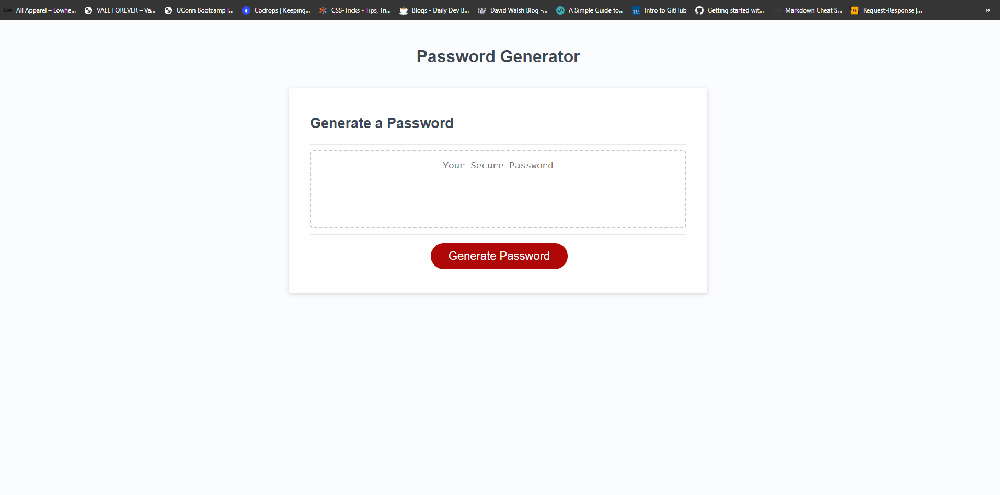

# password-generator

## Description

This is a random password generator where you're able to click a generate button and go throught the promts to create the password. Some of the promts ask whether you want uppercase, lowercase, numbers, and special characters in your password. I used JavaScript to make this possible, some syntaxes used for this were for loops, Math.random, Math.floor, if statements, etc. 

## Deployment

## Usage

## Code Source
